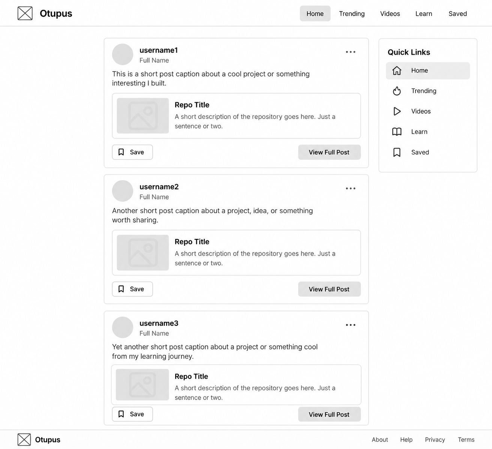
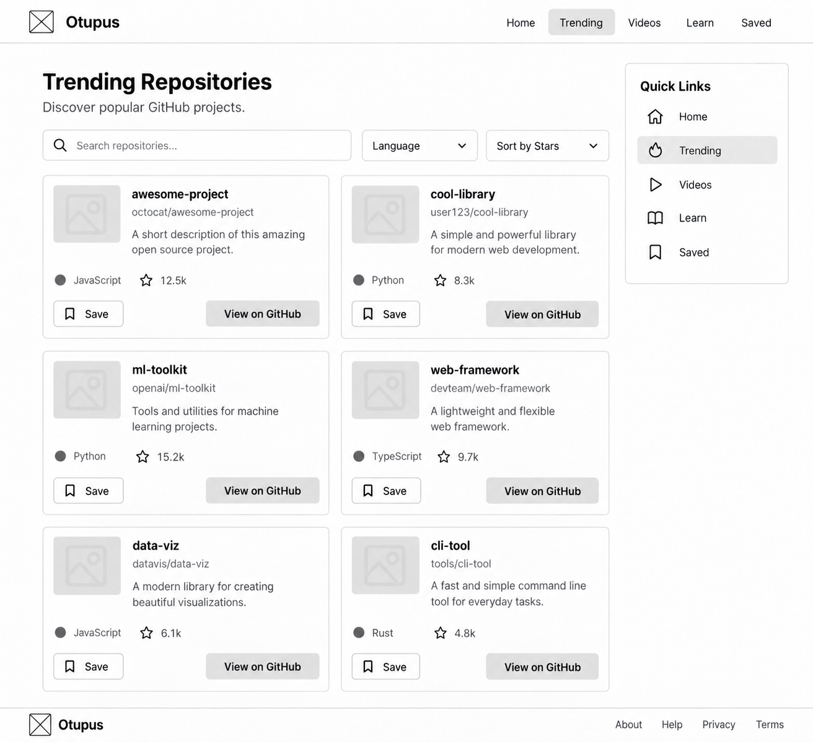

# Otupus — Project Proposal

**Course:** CSCI 3230U — Web Development  
**Project:** Otupus  
**Repository:** https://github.com/CreamCheesePeanutButter/Otupus

---

## 1. Project Overview

### 1.1 Application Description

Otupus is a web-based platform designed for software developers, computer science students, and programming enthusiasts to discover, explore, and save GitHub repositories while staying informed about technology-related news. Inspired by social media platforms such as Instagram and Reddit, Otupus features a home feed containing fictional user posts that showcase real GitHub repositories, accompanied by usernames, profile pictures, and short captions describing their experiences with different projects. Users can expand individual posts to view additional information about the fictional developer, including their biography, personal details, and full post description. Beyond the social feed, Otupus offers a Trending section that highlights popular GitHub repositories, a News section featuring articles categorized into Artificial Intelligence, Technology, and Stocks, and a Learn section that organizes educational GitHub repositories by programming language, helping users find resources for learning languages such as Java, JavaScript, HTML, C++, and Markdown. Through GitHub API integration, the application retrieves real repository information and provides direct links to the original projects. Users can also save posts, repositories, learning resources, and news articles for future reference. Overall, Otupus aims to combine social media-inspired project discovery, programming education, and technology news into one accessible and user-friendly platform.

---

## 2. Data Sources & APIs

Otupus will use two external APIs to retrieve GitHub repository information and YouTube videos.

### 2.1 GitHub REST API

**Documentation:** [GitHub REST API](https://docs.github.com/en/rest)

**Purpose:**  
Retrieves real GitHub repositories and their information for the Trending, Learn, and Home sections, including repository names, descriptions, programming languages, and star counts.

**Sample Data Usage:**

The following request searches for Python repositories with over 10,000 stars, sorted by popularity.

```bash
curl -G "https://api.github.com/search/repositories" \
  -H "Accept: application/vnd.github+json" \
  -H "X-GitHub-Api-Version: 2022-11-28" \
  --data-urlencode "q=language:python stars:>10000" \
  --data-urlencode "sort=stars" \
  --data-urlencode "order=desc" \
  --data-urlencode "per_page=1"
```

**Sample JSON Response (Illustrative):**

```json
{
  "total_count": 1425,
  "incomplete_results": false,
  "items": [
    {
      "id": 987654321,
      "name": "example-python-project",
      "full_name": "developer/example-python-project",
      "description": "An example Python repository.",
      "html_url": "https://github.com/developer/example-python-project",
      "owner": {
        "login": "developer",
        "avatar_url": "https://avatars.githubusercontent.com/u/123456"
      },
      "stargazers_count": 15000,
      "language": "Python",
      "forks_count": 182,
      "open_issues_count": 12,
      "topics": ["python", "open-source", "education"]
    }
  ]
}
```

**Fields Used:**

- `name` — Repository name.
- `full_name` — Repository owner and name.
- `description` — Repository description.
- `html_url` — Link to the original GitHub repository.
- `owner.login` — Repository owner's username.
- `owner.avatar_url` — Repository owner's avatar.
- `stargazers_count` — Number of stars.
- `language` — Primary programming language.
- `forks_count` — Number of forks.
- `open_issues_count` — Number of open issues and pull requests.
- `topics` — Repository categories and tags.

---

### 2.2 YouTube Data API v3

**Documentation:** [YouTube Data API v3](https://developers.google.com/youtube/v3)

**Purpose:**  
Retrieves YouTube videos related to Artificial Intelligence, Technology, and Stocks, allowing users to browse educational and informational video content within Otupus.

**Sample Data Usage:**

The following request searches YouTube for artificial intelligence videos and retrieves up to 10 results.

```http
GET https://www.googleapis.com/youtube/v3/search?part=snippet&type=video&q=artificial+intelligence&maxResults=10&key=YOUR_API_KEY
```

**Sample JSON Response (Illustrative):**

```json
{
  "kind": "youtube#searchListResponse",
  "items": [
    {
      "id": {
        "kind": "youtube#video",
        "videoId": "EXAMPLE_VIDEO_ID"
      },
      "snippet": {
        "publishedAt": "2026-10-08T12:00:00Z",
        "channelTitle": "Example Tech Channel",
        "title": "Artificial Intelligence Explained",
        "description": "An introduction to artificial intelligence and its applications.",
        "thumbnails": {
          "medium": {
            "url": "https://i.ytimg.com/vi/EXAMPLE_VIDEO_ID/mqdefault.jpg"
          }
        }
      }
    }
  ]
}
```

**Fields Used:**

- `id.videoId` — YouTube video identifier used for links and embedded playback.
- `snippet.title` — Video title.
- `snippet.description` — Video description.
- `snippet.channelTitle` — Name of the YouTube channel.
- `snippet.publishedAt` — Video publication date.
- `snippet.thumbnails.medium.url` — Video thumbnail image.

**Planned Categories:**

- **Artificial Intelligence:** AI developments, machine learning, and AI tools.
- **Technology:** Software, hardware, programming, and technology updates.
- **Stocks:** Stock market discussions, financial developments, and technology company news.

## 3. Comparable Applications

### 3.1 Instagram

**Website:** https://www.instagram.com/

**Similarities:**

- Provides a social media-style feed where users can scroll through posts and explore content shared by others.
- Displays user profiles, profile pictures, usernames, captions, and individual post details.

**How Otupus Differs:**

- Otupus focuses on showcasing GitHub repositories and programming experiences rather than photos and videos.
- The Home feed features fictional developer profiles and posts linking to real GitHub repositories, with expanded post pages displaying additional information about the developer and their project experiences.

### 3.2 GitHub Trending

**Website:** https://github.com/trending

**Similarities:**

- Allows users to discover popular GitHub repositories and software projects.
- Displays repository information such as names, descriptions, programming languages, and star counts.

**How Otupus Differs:**

- Otupus combines repository discovery with a social media-inspired interface, educational resources, and technology-related video content.
- In addition to trending repositories, users can browse learning resources organized by programming language and save repositories for future reference.

### 3.3 YouTube

**Website:** https://www.youtube.com/

**Similarities:**

- Allows users to discover and watch videos related to programming, technology, artificial intelligence, and other interests.
- Provides video thumbnails, titles, descriptions, and channel information.

**How Otupus Differs:**

- Otupus focuses specifically on technology-related videos, organizing content into Artificial Intelligence, Technology, and Stocks categories.
- Combines YouTube video discovery with GitHub repository browsing, programming learning resources, and a centralized bookmarking feature.

---

## 4. Scaled Feature Plan & Team Responsibilities

### 4.1 Core Application Requirements

Otupus will be developed as a React single-page application (SPA) with the following functionality:

- **API Integration:** Retrieve real GitHub repositories and YouTube video information using external APIs.
- **Search, Filter & Sort:** Allow users to search repositories, filter by programming language, and sort results by popularity or other criteria.
- **Detail Views:** Provide individual pages for social media posts using React Router and URL parameters.
- **Persistent Saved Items:** Allow users to bookmark posts, repositories, and videos using localStorage.
- **Controlled Forms:** Implement an interactive advanced repository search form with input validation.
- **Multiple Routes:** Support navigation between Home, Trending, Videos, Learn, Saved, and individual post pages.
- **Loading, Error & Empty States:** Display appropriate messages when API requests are loading, fail, or return no results.
- **Responsive Design:** Ensure the application works across desktop, tablet, and mobile devices.
- **Accessibility:** Use semantic HTML, labelled controls, keyboard navigation, and readable colour contrast.
- **Automated Testing:** Test selected application features and components.
- **Public Deployment:** Deploy Otupus to a publicly accessible website.

### 4.2 Planned Otupus Features

#### Home — Social Media Feed

- Display fictional developer posts created by the project team.
- Each post will include a username, full name, profile picture, short caption, and real GitHub repository link.
- Allow users to open an expanded post page containing the full post and additional fictional developer information, such as a biography, birthday, date joined, and programming interests.
- Retrieve linked repository information using the GitHub REST API.
- Allow users to bookmark posts for later viewing.
- User-created public posting and authentication will not be required.

#### Trending — GitHub Repositories

- Retrieve popular public repositories using the GitHub REST API.
- Display repository names, descriptions, owners, programming languages, star counts, and GitHub links.
- Allow users to search, filter, and sort repositories.
- Provide links to the original GitHub repositories.
- Allow users to bookmark repositories.

#### Videos — YouTube Content

- Integrate the YouTube Data API v3 to retrieve video information.
- Organize videos into three categories:
  - Artificial Intelligence
  - Technology
  - Stocks
- Display video cards containing thumbnails, titles, channels, and descriptions.
- Allow users to open or watch videos through YouTube.
- Allow users to bookmark videos.

#### Learn — Programming Resources

- Display educational GitHub repositories designed to help users learn programming.
- Organize learning resources by programming language:
  - Java
  - JavaScript
  - HTML
  - C++
  - Markdown
- Display repository cards containing names, descriptions, languages, and GitHub links.
- Retrieve repository information using the GitHub REST API.
- Allow users to filter resources by programming language.
- Allow users to bookmark educational repositories.

#### Saved — Bookmarked Content

- Provide a centralized location for previously saved content.
- Support bookmarks from Home, Trending, Videos, and Learn.
- Store saved items using localStorage so they remain available after refreshing the browser.
- Allow users to remove items from their saved collection.

---

### 4.3 Team Members & Feature Ownership

#### Role 1 — Project Lead

**Assigned to:** An Le (@CreamCheesePeanutButter)

**Primary Responsibilities:**

Oversees project planning, team coordination, technical integration, and development progress. Helps ensure the application meets course requirements and milestones.

**Assigned Vertical Slice:** Trending Repository Discovery

#### Role 2 — Frontend & UI/UX Designer

**Assigned to:** Adam

**Primary Responsibilities:**

Responsible for the visual design, responsive layouts, navigation, and overall user experience of Otupus. Develops reusable frontend components using HTML, CSS, JavaScript, and React.

**Assigned Vertical Slice:** Social Media Feed & Post Details

#### Role 3 — Backend Lead & Data Integration

**Assigned to:** Nabih

**Primary Responsibilities:**

Responsible for external API communication, application data handling, and supporting services required for the website's functionality.

**Assigned Vertical Slice:** YouTube Video Discovery

---

### 4.4 Shared Team Responsibilities

All team members will collaborate on:

- Building the shared application layout and navigation.
- Developing the Learn programming resources section.
- Implementing reusable repository and video cards.
- Integrating bookmarking functionality across the application.
- Maintaining accessibility and responsive design.
- Writing and reviewing automated tests.
- Tracking progress using GitHub Issues and Projects.
- Using feature branches, commits, and pull requests.
- Testing, debugging, and deploying the completed application.

---

## 5. UI Wireframes & Navigation

The following wireframes illustrate the proposed layout and navigation of Otupus. They represent the planned user interface for the HTML/CSS prototype and future React application.

### 5.1 Home — Social Media Feed

The Home page displays fictional developer posts featuring real GitHub repositories. Users can browse posts, save content, and open expanded post detail pages.



### 5.2 Trending — GitHub Repositories

The Trending page displays popular GitHub repositories retrieved using the GitHub REST API. Users can search, filter by programming language, sort repositories, and save projects.


